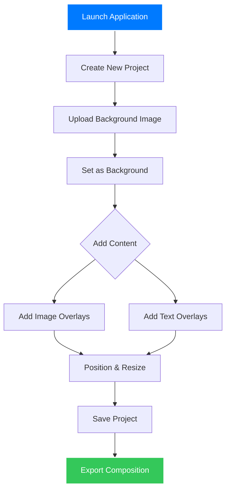
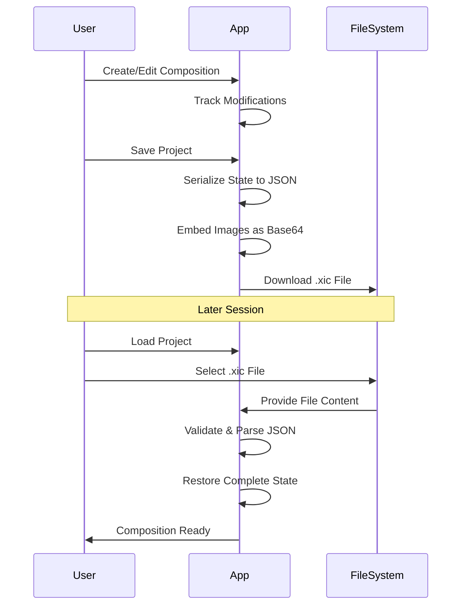
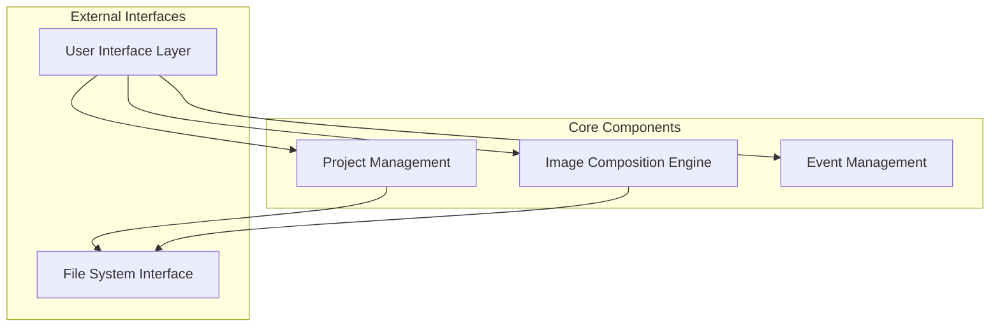

# xsukax Image Composer

[](https://www.gnu.org/licenses/gpl-3.0)
[](https://developer.mozilla.org/en-US/docs/Web/JavaScript)
[](https://developer.mozilla.org/en-US/docs/Web/API/Canvas_API)
[](#)

A professional, client-side image composition tool that enables users to create stunning visual compositions with pixel-perfect positioning, aspect ratio preservation, and comprehensive project management capabilities.


## 🎯 Project Overview

**xsukax Image Composer** is a sophisticated, browser-based image composition application designed for professionals, designers, and content creators who need to combine multiple images and text elements into cohesive visual compositions. Built as a single HTML file with zero dependencies, the application offers enterprise-grade functionality while maintaining complete client-side operation.

### Core Capabilities

- **Multi-layer Composition**: Combine background images with unlimited overlay images and text elements
- **Professional Project Management**: Save and load complete projects with embedded assets
- **Pixel-Perfect Export**: Export compositions at original background image resolution
- **Responsive Design**: Optimized for desktop, tablet, and mobile devices
- **Aspect Ratio Preservation**: Automatic maintenance of image proportions during resizing
- **Real-time Preview**: WYSIWYG editing with live preview of final output

### Target Use Cases

- Social media content creation
- Marketing material design
- Presentation graphics
- Educational content development
- Personal photo editing and collaging
- Rapid prototyping of visual concepts

## 🔒 Security and Privacy Benefits

### Client-Side Architecture
**Complete Local Processing**: All image processing, composition, and project management operations occur entirely within the user's browser. No data is transmitted to external servers, ensuring absolute privacy and security of sensitive visual content.

### Data Protection Measures

#### Zero Server Dependency
- **No Upload Requirements**: Images never leave the user's device
- **Offline Capability**: Full functionality available without internet connection
- **No Analytics Tracking**: No user behavior monitoring or data collection
- **No External API Calls**: Complete independence from third-party services

#### Secure Data Handling
- **Base64 Encoding**: Images are securely encoded and stored locally
- **Memory Management**: Automatic cleanup of temporary data structures
- **Cross-Site Scripting Protection**: Built-in XSS prevention through proper DOM handling
- **File System Isolation**: Limited to user-selected files only

#### Privacy-First Design
- **No Cookies**: Application state managed without persistent tracking
- **No Local Storage of Sensitive Data**: Temporary session data only
- **User-Controlled Data Export**: All project data remains under user control
- **Transparent Data Flow**: Open-source codebase allows complete audit of data handling

### Enterprise Security Compliance
- Suitable for organizations with strict data privacy requirements
- Compatible with air-gapped environments
- No dependency on external CDNs or third-party resources
- Self-contained deployment model

## ✨ Features and Advantages

### Professional Image Composition
- **Intelligent Background Handling**: Automatic scaling and positioning with letterboxing support
- **Aspect Ratio Protection**: Images maintain original proportions during all operations
- **Sub-pixel Positioning**: Precise overlay placement with drag-and-drop interface
- **Layer Management**: Visual indicators and selection states for complex compositions

### Advanced Text Capabilities
- **Professional Typography**: 12 carefully selected font families
- **Color Customization**: Full spectrum color picker for text styling
- **Dynamic Font Sizing**: Intuitive resize handles for text scaling (12px-120px)
- **Text Effects**: Automatic shadow generation for enhanced readability

### Project Management System
- **Complete Project Preservation**: Save entire compositions with embedded assets
- **Portable Project Format**: Self-contained .xic files with version control
- **Modification Tracking**: Visual indication of unsaved changes
- **Validation System**: Robust file format validation and error recovery

### User Experience Excellence
- **Apple-Inspired Design**: Clean, modern interface following contemporary design principles
- **Touch-Optimized Controls**: Full mobile and tablet compatibility
- **Real-Time Feedback**: Progress indicators, notifications, and status updates
- **Accessibility Features**: Keyboard navigation and screen reader compatibility

### Technical Advantages
- **Zero Dependencies**: Single HTML file deployment
- **Cross-Platform Compatibility**: Works on any modern browser
- **High Performance**: Optimized rendering and memory management
- **Scalable Architecture**: Modular code structure for easy maintenance

## 🚀 Installation Instructions

### Prerequisites
- Modern web browser (Chrome 90+, Firefox 88+, Safari 14+, Edge 90+)
- JavaScript enabled
- Minimum 2GB RAM recommended for large image processing

### Installation Methods

#### Method 1: Direct Download (Recommended)
```bash
# Clone the repository
git clone https://github.com/xsukax/xsukax-Image-Composer.git

# Navigate to the directory
cd xsukax-Image-Composer

# Open the application
open index.html  # macOS
start index.html # Windows
xdg-open index.html # Linux
```

#### Method 2: GitHub Download
1. Visit the [GitHub repository](https://github.com/xsukax/xsukax-Image-Composer)
2. Click the "Code" button and select "Download ZIP"
3. Extract the ZIP file to your desired location
4. Double-click `index.html` to launch the application

#### Method 3: Direct Browser Access
```bash
# Serve locally using Python (optional)
python -m http.server 8000  # Python 3
python -m SimpleHTTPServer 8000  # Python 2

# Access at: http://localhost:8000
```

### Verification
Upon successful installation, you should see:
- The xsukax Image Composer interface
- Project management controls
- File upload areas
- Canvas workspace

## 📖 Usage Guide

### Getting Started Workflow



### Step-by-Step Instructions

#### 1. Project Initialization
```
1. Open index.html in your browser
2. Click "New Project" to start fresh
3. The workspace canvas will appear ready for content
```

#### 2. Background Image Setup
```
1. Click "Choose Images (JPG, PNG)" to upload images
2. Select your desired background image from uploaded files
3. Click "Background" button under the chosen image
4. The image will fill the canvas with proper scaling
```

#### 3. Adding Image Overlays
```
1. Upload additional images using the same upload interface
2. Click "Overlay" button under any uploaded image
3. The image appears as a draggable overlay on the canvas
4. Use corner handles to resize while maintaining aspect ratio
5. Drag to reposition anywhere on the canvas
```

#### 4. Text Overlay Creation
```
1. Navigate to the "Text Overlays" section
2. Enter your desired text in the input field
3. Select font family from the dropdown menu
4. Choose text color using the color picker
5. Click "Add Text" to place on canvas
6. Resize using orange corner handles
7. Edit text by clicking "Edit" in the text list
```

### Advanced Features

#### Project Management Workflow



#### Layer Management
- **Selection States**: Click any overlay to select (blue border for images, orange for text)
- **Z-Index Control**: Text overlays automatically appear above image overlays
- **Visual Indicators**: Aspect ratio and font size indicators on selected elements
- **Boundary Constraints**: Overlays automatically constrain to canvas boundaries

#### Export Process
```
1. Ensure your composition is complete
2. Click "Export Perfect Composition"
3. The system renders at original background resolution
4. High-quality PNG file downloads automatically
5. Filename includes project name and timestamp
```

### Keyboard Shortcuts
- **Enter**: Add text overlay (when text input is focused)
- **Escape**: Close modal dialogs
- **Click outside modal**: Close modal dialogs

### File Format Specifications

#### Supported Input Formats
- **Images**: JPEG (.jpg, .jpeg), PNG (.png)
- **Projects**: xsukax Image Composer (.xic)

#### Project File Structure (.xic)
```json
{
  "version": "1.0.0",
  "appName": "xsukax Image Composer",
  "projectName": "My Project",
  "created": "2024-01-01T00:00:00.000Z",
  "modified": "2024-01-01T00:00:00.000Z",
  "canvas": {
    "width": 800,
    "height": 520
  },
  "background": {
    "id": "unique_id",
    "src": "data:image/png;base64,iVBORw0KGgoAAAANSUh...",
    "name": "background.jpg",
    "naturalWidth": 1920,
    "naturalHeight": 1080,
    "aspectRatio": 1.777
  },
  "overlays": {
    "images": [...],
    "texts": [...]
  }
}
```

## 🔧 Technical Architecture

### Application Structure



### Performance Considerations
- **Memory Optimization**: Efficient handling of large image files
- **Canvas Rendering**: Hardware-accelerated drawing operations
- **Event Throttling**: Optimized drag and resize operations
- **Lazy Loading**: Images loaded only when needed

## 🤝 Contributing

We welcome contributions to improve xsukax Image Composer! Please read our contribution guidelines:

### Development Setup
```bash
git clone https://github.com/xsukax/xsukax-Image-Composer.git
cd xsukax-Image-Composer
# No build process required - edit index.html directly
```

### Contribution Areas
- Feature enhancements
- Bug fixes
- Documentation improvements
- Performance optimizations
- Accessibility improvements
- Mobile experience enhancements

### Code Standards
- Maintain single-file architecture
- Follow existing code style and commenting patterns
- Ensure cross-browser compatibility
- Test on multiple devices and screen sizes

## 📄 Licensing Information

This project is licensed under the **GNU General Public License v3.0** (GPL-3.0).

### License Summary
- ✅ **Freedom to Use**: Use the software for any purpose
- ✅ **Freedom to Study**: Examine and understand how the software works
- ✅ **Freedom to Modify**: Adapt the software to your needs
- ✅ **Freedom to Distribute**: Share the software with others
- ⚠️ **Copyleft Requirement**: Derivative works must also be licensed under GPL-3.0

### Full License
The complete license text is available in the [LICENSE](LICENSE) file in this repository or at [https://www.gnu.org/licenses/gpl-3.0.html](https://www.gnu.org/licenses/gpl-3.0.html).

### Attribution
When redistributing or modifying this software, please maintain appropriate attribution to the original authors and include the GPL-3.0 license notice.

### Common Issues
- **Browser Compatibility**: Ensure you're using a modern browser with JavaScript enabled
- **Memory Issues**: For large images, ensure sufficient available RAM
- **Mobile Performance**: Some older mobile devices may experience slower performance with large compositions

---

**Developed with ❤️ by the xsukax team**

*Empowering creativity through privacy-focused, professional-grade image composition tools.*
